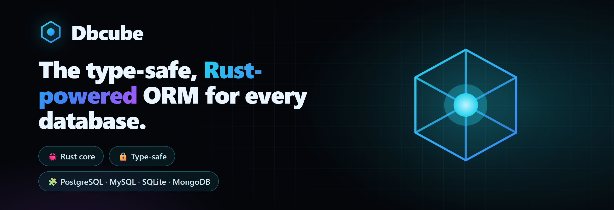

<div align="center">
  
  <p><strong>The type-safe, Rust-powered ORM for Node.js — one fluent API for every database.</strong></p>

<a href="https://www.npmjs.com/package/dbcube"></a>
<a href="https://www.npmjs.com/package/dbcube"></a>
<a href="./LICENSE"></a>
<a href="./CONTRIBUTING.md"></a>
<br /><br />

<a href="https://dbcube.dev/getting-started/introduction">Quickstart</a>
<span>&nbsp;•&nbsp;</span>
<a href="https://dbcube.dev">Website</a>
<span>&nbsp;•&nbsp;</span>
<a href="https://dbcube.dev/getting-started/introduction">Docs</a>
<span>&nbsp;•&nbsp;</span>
<a href="https://github.com/Dbcube/examples">Examples</a>
<span>&nbsp;•&nbsp;</span>
<a href="https://dbcube.dev/performance/benchmarks">Benchmarks</a>
<span>&nbsp;•&nbsp;</span>
<a href="https://dbcube.dev/blog">Blog</a>

  <hr />
</div>

## What is Dbcube?

**Dbcube** is a modern ORM for Node.js & TypeScript. You write clean, fully typed
code; a **native Rust engine** does query parsing, SQL generation, execution and
row decoding **off the event loop**. The result is an ORM that's fast under real
load and feels great to use.

- 🦀 **Rust core** — the heavy lifting runs in compiled native code, not the JS event loop.
- 🔒 **Type-safe** — generate types from your schema; queries are checked at compile time.
- 🧩 **One API, four engines** — **PostgreSQL, MySQL, SQLite and MongoDB** with the same fluent builder.
- ☁️ **Cloud-ready** — works with **Supabase, Turso, PlanetScale, MongoDB Atlas, Neon, RDS** over TLS.
- 🧊 **Schema as code** — declarative `.cube` files, migrations with rollback, seeders and runtime triggers.
- ⚡ **Fast** — beats Prisma across the board in our [reproducible benchmark](https://dbcube.dev/performance/benchmarks).

## Install

```bash
npm install dbcube
```

That's it — the native engine binary is fetched automatically for your platform
(no C++ toolchain required).

## Quickstart

**1. Configure a connection** in `dbcube.config.js`:

```js
module.exports = (config) =>
  config.set({
    databases: {
      app: {
        type: "postgres", // "mysql" | "postgres" | "sqlite" | "mongodb"
        config: { URL: process.env.DATABASE_URL },
      },
    },
  });
```

**2. Describe a table** in `dbcube/users.table.cube`:

```ts
@database("app");

@meta({ name: "users"; description: "User accounts"; });

@columns({
  id:    { type: "int";     options: ["primary", "autoincrement"]; };
  name:  { type: "varchar"; length: "255"; options: ["not null"]; };
  email: { type: "varchar"; length: "255"; options: ["not null", "unique"]; };
  status:{ type: "varchar"; length: "20"; defaultValue: "active"; };
});
```

**3. Create it and generate types:**

```bash
npx dbcube run table:fresh   # create tables from your .cube files
npx dbcube generate          # write dbcube/types.ts
```

**4. Query — typed end to end:**

```ts
import { dbcube } from "dbcube";
import type { User } from "./dbcube/types";

const db = dbcube.database("app");

// read
const users = await db
  .table<User>("users")
  .where("status", "=", "active")
  .orderBy("age", "DESC")
  .limit(20)
  .get(); // → User[]

// write (insert returns the rows, with generated ids)
const [created] = await db
  .table<User>("users")
  .insert([{ name: "Ada Lovelace", email: "ada@example.com" }]);

// atomic transaction in ONE network round-trip
await db.batch((b) => {
  b.table("accounts").where("id", "=", 1).decrement("balance", 200);
  b.table("accounts").where("id", "=", 2).increment("balance", 200);
});

// eager-loaded relations, no N+1
const withOrders = await db
  .table<User>("users")
  .with("orders", { table: "orders", foreignKey: "user_id", type: "many" })
  .get();
```

> Heads up: `update()` and `delete()` **require** a `where()` (no accidental mass
> writes), `insert()` always takes an array, and `where()` is always
> `where(column, operator, value)`.

## One API, every database

The same query code runs on every engine — only the config entry changes.

| Engine     | `type`     | Cloud hosts           |
| ---------- | ---------- | --------------------- |
| PostgreSQL | `postgres` | Supabase · Neon · RDS |
| MySQL      | `mysql`    | PlanetScale · Aiven   |
| SQLite     | `sqlite`   | Turso (libSQL)        |
| MongoDB    | `mongodb`  | MongoDB Atlas         |

```js
// Turso (SQLite at the edge)
edge: { type: "sqlite", config: { URL: process.env.TURSO_URL, AUTH_TOKEN: process.env.TURSO_TOKEN } }
```

## Performance

Dbcube is benchmarked against **Prisma, Drizzle, TypeORM and Knex** on a real
PostgreSQL 16 database — identical schema, data, machine and connection budget.
It's **#1 of all five at reads, transactions and concurrency**, and beats Prisma
on every operation. Where it isn't first (raw bulk insert → Knex), we say so.

The suite is fully reproducible — run it yourself:

```bash
git clone https://github.com/Dbcube/benchmarks && cd benchmarks
npm install && npm run db:up && npm run prepare:db && npx prisma generate && npm run bench
```

Full table & methodology → **[dbcube.dev/performance/benchmarks](https://dbcube.dev/performance/benchmarks)**

## The CLI

```bash
npx dbcube init                # scaffold a project
npx dbcube run table:fresh     # create tables from .cube files
npx dbcube run table:alter     # apply a .alter.cube (keeps data)
npx dbcube run seeder:add      # run a .seeder.cube
npx dbcube generate            # regenerate dbcube/types.ts
npx dbcube run pull            # introspect an existing DB into .cube files
npx dbcube migrate:rollback    # roll back the last migration
npx dbcube doctor              # health checks
```

## Try it locally

This repo ships a Docker setup and a runnable starter so you can try Dbcube in
under a minute:

```bash
git clone https://github.com/Dbcube/dbcube && cd dbcube
./scripts/db.sh up postgres            # start a local Postgres
cd examples/quickstart
npm install && npm run setup && npm start
```

## What's in this repo

```
dbcube/
├── examples/quickstart/   a minimal, runnable Dbcube app
├── docker/                docker-compose for Postgres / MySQL / MongoDB
├── scripts/               db.sh — start/stop local databases
├── sandbox/               a scratch file to try queries
├── ARCHITECTURE.md        how Dbcube is put together (high level)
└── .env.example           connection strings for the docker databases
```

> The native engine and the published packages are not in this repo — they're on
> npm (`npm install dbcube`). This is the community front door: docs, examples and
> setup. See [ARCHITECTURE.md](./ARCHITECTURE.md).

## Ecosystem

| Repo                                                                             | What                                                                       |
| -------------------------------------------------------------------------------- | -------------------------------------------------------------------------- |
| [examples](https://github.com/Dbcube/examples)                                   | Runnable examples + real-world use cases (blog, checkout, auth, dashboard) |
| [benchmarks](https://github.com/Dbcube/benchmarks)                               | Reproducible benchmark suite vs Prisma/Drizzle/TypeORM/Knex                |
| [skills](https://github.com/Dbcube/skills)                                       | Official Claude Code skill — native Dbcube support in your editor          |
| [vscode-extension-formater](https://github.com/Dbcube/vscode-extension-formater) | `.cube` syntax highlighting, IntelliSense & validation                     |

## Editor & AI tooling

- **VS Code** — install the Dbcube extension for `.cube` highlighting and validation.
- **Claude Code** — `​/plugin marketplace add Dbcube/skills` then `​/plugin install dbcube@dbcube` for native, accurate Dbcube assistance.

## Community & support

- 💬 **Discussions / questions** → [GitHub Discussions](https://github.com/Dbcube/dbcube/discussions)
- 🐛 **Bug reports** → [open an issue](https://github.com/Dbcube/dbcube/issues/new/choose)
- 💡 **Feature requests** → [open an issue](https://github.com/Dbcube/dbcube/issues/new/choose)
- 📖 **Docs** → [dbcube.dev](https://dbcube.dev)

If Dbcube is useful to you, please **★ star the repo** — it genuinely helps.

## Contributing

We welcome contributions! See [CONTRIBUTING.md](./CONTRIBUTING.md) and our
[Code of Conduct](./CODE_OF_CONDUCT.md).

## Security

Found a vulnerability? Please report it privately — see [SECURITY.md](./SECURITY.md).

## License

[MIT](./LICENSE) © Dbcube
